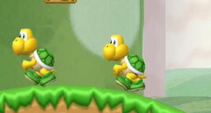
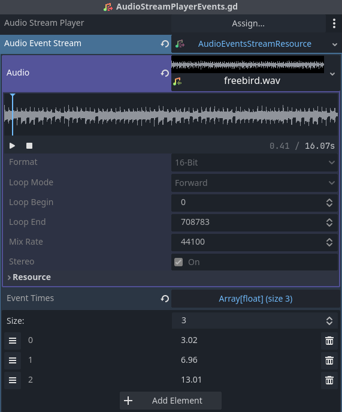
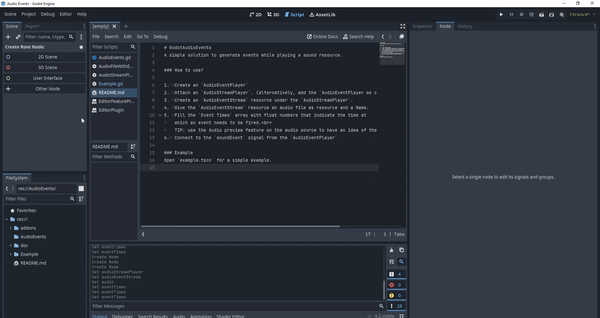

# GodotAudioEvents
A simple solution to generate events while playing a sound resource.

Ever wanted to recreate the silly koopa dance that is timed with the music (BAH BAH)?

With this solution that is possible!

### How to use?

1. 	Create an `AudioEventPlayer`
2. 	Attach an `AudioStreamPlayer`. (alternatively, add the `AudioEventPlayer as child to the `AudioStreamPlayer`)
3. 	Create an `AudioEventStream` resource under the `AudioStreamPlayer`.
4. 	Give the `AudioEventStream` resource an audio file as resource and a Name.
5. 	Fill the `Event Times` array with float numbers that indicate the time at 
	which an event needs to be fired. 
	TIP: use the Audio preview feature on the audio source to have an idea of the timings.
	
6.	Connect to the `soundEvent` signal from the `AudioEventPlayer`

### Example
Open `example.tscn` for a simple example.

### License
This project is MIT licensed, you can do whatever you want with it :)
